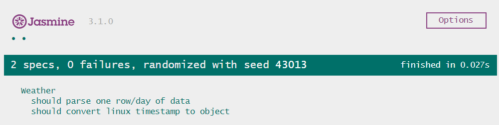
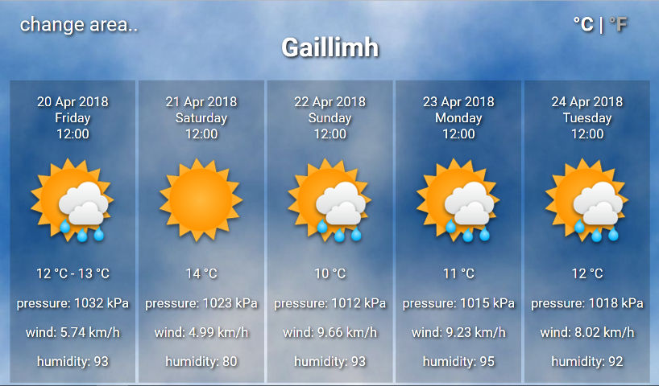

## Pure Weather

For many years I have been using [bootstrap](https://github.com/toporny/andrea_project/), [AngularJS](https://github.com/toporny/just_words), [Angular 2+](https://github.com/toporny/angular-2-dynamic-component) and [Sass](https://github.com/toporny/andrea_project),  jQuery and many other plugins but time goes on and now it's time to do something from scratch :)

Without any CSS or javascript libraries/frameworks.

So here it is: "Pure Weather" app.

Pure means: no javascript framework, no jQuery, no CSS framework. 
This project is made only with javascript (EC6), HTML, CSS.
Whole javascript code weight 12kilobytes and that's it. Super fast and super light.

## App info:
- Provides responsive design
- Uses: Google API, OpenWeatherMap API
- Works well on desktop and mobile browsers
- uses vh and vw units instead pixels
- has configuration file: js/const.js 


## How to lunch?
Step1: install and launch http-server:
```sh
$ git https://github.com/toporny/pure_weather.git
$ cd pure_weather
$ npm install
$ npm start
```

Step2: open browser with this url: http://127.0.0.1:8080/index.html


## How to test?
Open Jasmine SpecRunner.html in browser: http://127.0.0.1:8080/SpecRunner.html




## Problem with other browsers
ECMA6 means it works only on modern browsers.
For all of those who wants to try it on older browsers they need to compile this code from EC6 to EC5 with babel:
Step1: install envinroment
```sh
npm run babel
npm run start
```
Step2: open browser with this url: http://127.0.0.1:8080/index_es5.html


